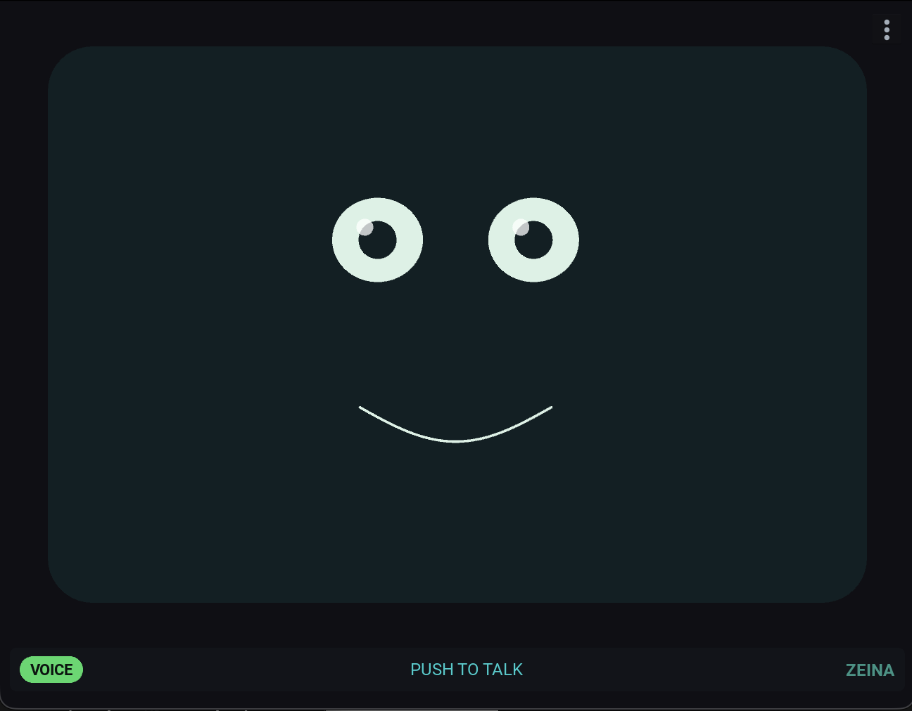
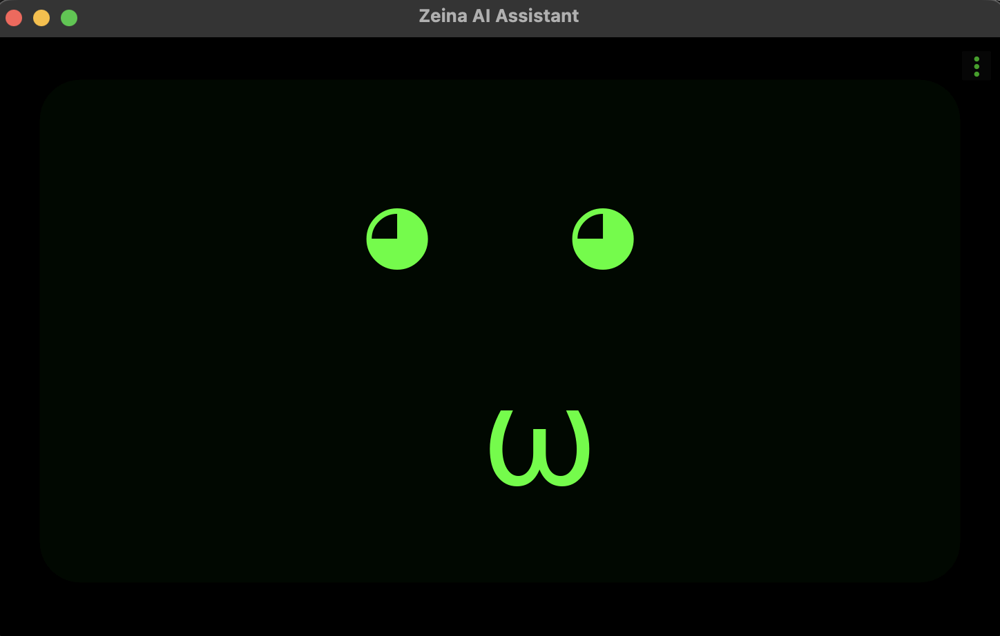
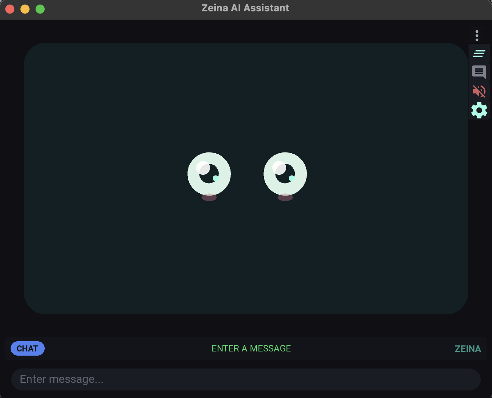
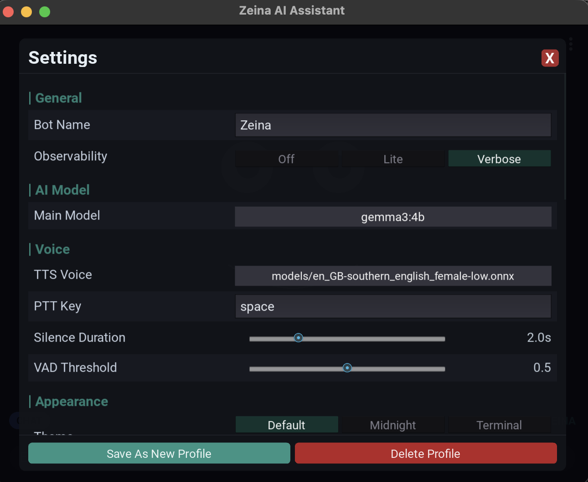
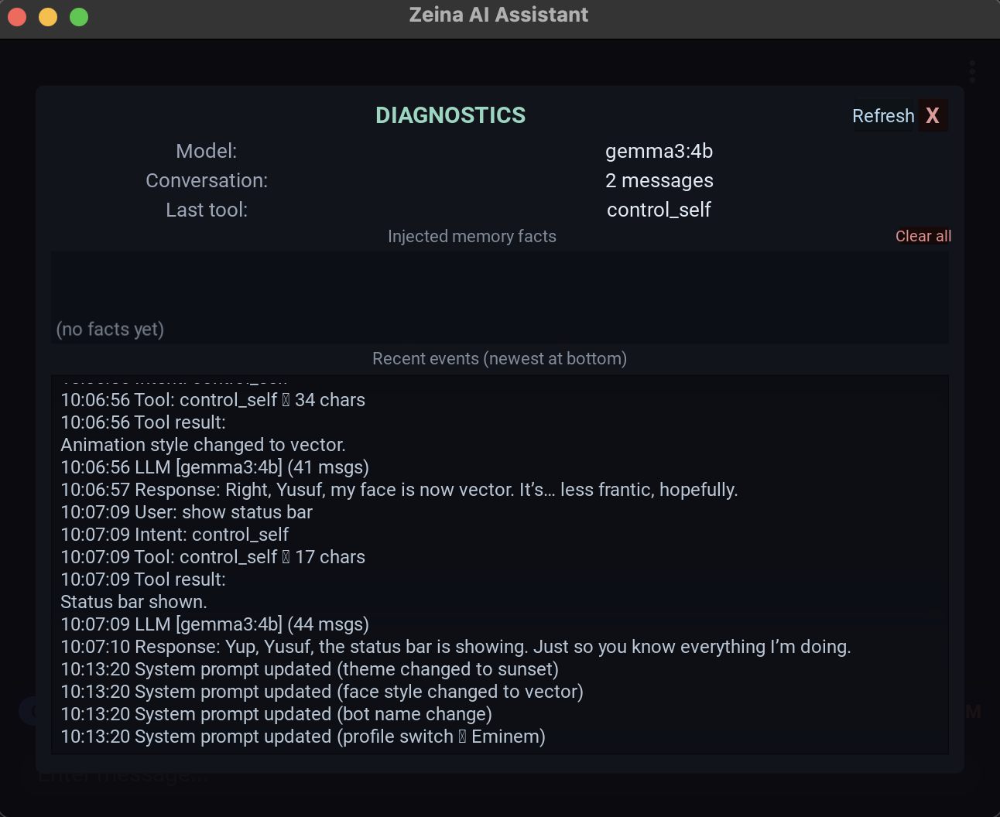

# Zeina AI Assistant

A voice-activated AI assistant built entirely with open-source tools. Talk naturally using your voice, or switch to chat mode for text interaction. Features tool calling for web search, weather, calculations, file access, and more. Ships with an animated face and a full Kivy GUI.

## Features

- **Push-to-Talk**: Push spacebar to start, VAD auto-stops on silence
- **Voice Activity Detection (VAD)**: Silero VAD detects when you finish speaking
- **Continuous Conversation**: Auto-listens for follow-up questions after responding
- **Interrupt Anytime**: Push spacebar while Zeina is speaking for instant interruption
- **Dual Modes**: Voice mode (with TTS) and Chat mode (text only), toggle with TAB
- **Tool Calling**: Web search, weather, calculator, time, location, file access, system health
- **Screen Vision**: Ask Zeina what's on your screen — she takes a screenshot, interprets it with a vision model, and responds naturally
- **Animated Face**: Vector (procedural) and ASCII art animation modes
- **Settings UI**: Full-screen settings overlay with profiles, themes, and voice control
- **Model Switching**: Change Ollama models on the fly with Ctrl+M or via settings
- **Themes**: Default, Midnight, Terminal, Sunset, and Ocean color themes
- **Profiles**: Multiple named profiles with independent settings and AI context
- **Diagnostics**: Ctrl+D overlay showing live assistant state, event log, and deletable memories
- **Memories**: Per-profile persistent facts about the user (up to 50 facts, auto-extracted and deduplicated)

## Screenshots

### Default Theme — Voice Mode



*Animated vector face with live expression states. Status bar shows mode, status, and bot name.*

---

### Terminal Theme



*Green-on-black ASCII-style face. Toggle themes via settings or by voice.*

---

### Chat Mode with Menu Open



*The three-dot menu exposes quick toggles: status bar, chat transcript, TTS mute, and settings.*

---

### Settings



*Full settings overlay — models, voice, VAD, themes, profiles, and more. No config file editing needed.*

---

### Diagnostics Overlay



*Ctrl+D shows live model state, memory facts, and a rolling event log of the session pipeline.*

---

## Prerequisites

### System Dependencies

1. **Python 3.10+**

2. **Ollama** — local LLM runtime
   ```bash
   # Install from https://ollama.ai
   # macOS/Linux:
   curl -fsSL https://ollama.ai/install.sh | sh
   ```

3. **PortAudio** — required by sounddevice for microphone access
   ```bash
   # macOS
   brew install portaudio

   # Ubuntu/Debian
   sudo apt install portaudio19-dev

   # Raspberry Pi (Raspberry Pi OS)
   sudo apt install portaudio19-dev
   ```

4. **SDL2** — required by Kivy and pygame
   ```bash
   # macOS
   brew install sdl2 sdl2_image sdl2_mixer sdl2_ttf

   # Ubuntu/Debian
   sudo apt install libsdl2-dev libsdl2-image-dev libsdl2-mixer-dev libsdl2-ttf-dev

   # Raspberry Pi
   sudo apt install libsdl2-dev libsdl2-image-dev libsdl2-mixer-dev libsdl2-ttf-dev
   ```

5. **FFmpeg** — required by Whisper for audio decoding
   ```bash
   # macOS
   brew install ffmpeg

   # Ubuntu/Debian / Raspberry Pi
   sudo apt install ffmpeg
   ```

## Installation

```bash
# Clone the repository
git clone <repo-url> && cd Zeina

# Create virtual environment
python3 -m venv venv
source venv/bin/activate  # On Windows: venv\Scripts\activate

# Install Python dependencies
pip install -r requirements.txt
```

### Pull Ollama Models

Zeina uses two Ollama models. Pull both before running:

```bash
# Main conversation model (~4.7 GB)
ollama pull llama3.1:8b

# Fast intent classifier (~2 GB)
ollama pull llama3.2:3b
```

You can change the main model from Settings > AI Model or via Ctrl+M. The intent classifier model is configured in `zeina/config.py`.

### Download a Piper TTS Voice

Zeina uses [Piper TTS](https://github.com/rhasspy/piper) for voice synthesis. A voice model must be placed in the `models/` directory.

The default voice configured in `zeina/config.py` is `en_GB-southern_english_female-low`. Download it:

```bash
mkdir -p models

# Download the voice model and its config (both files are required)
wget -P models https://huggingface.co/rhasspy/piper-voices/resolve/main/en/en_GB/southern_english_female/low/en_GB-southern_english_female-low.onnx
wget -P models https://huggingface.co/rhasspy/piper-voices/resolve/main/en/en_GB/southern_english_female/low/en_GB-southern_english_female-low.onnx.json
```

Browse all available voices at [huggingface.co/rhasspy/piper-voices](https://huggingface.co/rhasspy/piper-voices). Additional voices can be selected from **Settings > Voice > TTS Voice** — place their `.onnx` and `.onnx.json` files in the `models/` directory first.

## Running

```bash
# Start Ollama (if not already running as a service)
ollama serve

# Activate the virtual environment
source venv/bin/activate

# Launch the GUI (primary interface)
python gui_main.py

# Or run the legacy terminal mode
python main.py
```

## Controls

| Key | Action |
|-----|--------|
| `SPACEBAR` | Push to talk / stop recording / interrupt TTS |
| `TAB` | Toggle between Voice and Chat mode |
| `Ctrl+M` | Change Ollama model |
| `Ctrl+D` | Toggle diagnostics overlay |
| `ESC` | Close overlay or quit |

## 3-Dot Menu (top-right corner)

| Icon | Action |
|------|--------|
| Monitor | Show/hide status bar |
| Chat | Show/hide message transcript |
| Volume | Mute/unmute TTS audio |
| Cog | Open settings |

## Voice Mode

Push spacebar to start recording. Speak naturally — VAD auto-detects when you stop (~2s silence). Zeina transcribes, thinks, responds with voice, then auto-listens for follow-ups. Push spacebar at any time to interrupt.

## Chat Mode

Press TAB to switch. A text input appears at the bottom of the screen. Type your message and press Enter. Responses stream into chat bubbles (no TTS playback in chat mode).

## Tools

Zeina classifies intent automatically and calls the right tool when needed.

| Tool | Trigger phrases | Description |
|------|----------------|-------------|
| **web_search** | "Search for...", "Look up..." | DuckDuckGo search, top 5 results |
| **get_weather** | "What's the weather in..." | OpenWeatherMap current conditions |
| **calculate** | "Calculate...", math expressions | Safe eval with trig, logs, constants |
| **get_current_time** | "What time is it?", "What day is it?" | Current date/time with timezone support |
| **get_location** | "Where am I?", "What's my location?" | IP-based geolocation via ipinfo.io |
| **read_file** | "Read my .zshrc", "Show me ~/notes.txt" | File contents (≤ 10 KB, home dir only) |
| **list_directory** | "What's in my Documents folder?" | Directory listing (dirs first, cap 100) |
| **get_system_health** | "How's my computer?", "Check CPU usage" | CPU, memory, disk, battery, uptime |
| **take_screenshot** | "What's on my screen?", "What do you see?", "Read this error" | Captures screen, vision model describes it, main LLM responds |
| **remember** | "Remember that...", "Don't forget..." | Save a personal fact to long-term memory |
| **execute_shell** | "Open Safari", "Run ls", "Launch VS Code" | Execute a shell command (requires verbal confirmation) |
| **read_clipboard** | "What's in my clipboard?", "Read my clipboard" | Read the current clipboard text |
| **write_clipboard** | "Copy X to clipboard", "Put that in my clipboard" | Write text to the clipboard |

### Weather Tool Setup

The weather tool requires a free OpenWeatherMap API key:
1. Sign up at [openweathermap.org](https://openweathermap.org/api)
2. Copy `.env.example` to `.env` and add your key:
   ```bash
   cp .env.example .env
   # Edit .env and set OPENWEATHERMAP_API_KEY=your_key_here
   ```

## Configuration

Most settings are managed through the in-app Settings screen (⚙ icon). For low-level tuning, edit `zeina/config.py`:

| Setting | Default | Description |
|---------|---------|-------------|
| `OLLAMA_MODEL` | `llama3.1:8b` | Main conversation model |
| `INTENT_CLASSIFIER_MODEL` | `llama3.2:3b` | Fast tool-routing model |
| `WHISPER_MODEL` | `base` | ASR model size (`tiny`, `base`, `small`, `medium`, `large-v3`) |
| `WHISPER_DEVICE` | `cpu` | Use `cuda` for GPU acceleration |
| `TTS_VOICE` | `models/en_GB-southern_english_female-low.onnx` | Piper voice model path |
| `VAD_THRESHOLD` | `0.5` | Speech detection sensitivity (0–1, lower = more sensitive) |
| `SILENCE_DURATION` | `2.0` | Seconds of silence before auto-stop |
| `LISTENING_TIMEOUT` | `5.0` | Max seconds to wait for speech |
| `OBSERVABILITY_LEVEL` | `off` | `off` / `lite` / `verbose` — terminal debug output |

## Troubleshooting

**"Ollama connection failed"**
- Ensure Ollama is running: `ollama serve`
- Check models are pulled: `ollama list`

**"No speech detected"**
- Check your microphone is selected and working
- Lower `VAD_THRESHOLD` (e.g., 0.4) in Settings > Voice
- Try a larger Whisper model (`small` or `medium`)

**"Recording cuts off mid-sentence"**
- Increase `SILENCE_DURATION` (e.g., 2.5) in Settings > Voice

**Piper TTS not working**
- Ensure the `.onnx` and `.onnx.json` files are both in `models/`
- Check the path in `zeina/config.py` matches the filename exactly

**Slow performance**
- Use `tiny` or `base` Whisper model (Settings > Voice or `config.py`)
- Use a smaller Ollama model (`llama3.2:3b` for fast responses)
- Enable GPU: set `WHISPER_DEVICE = "cuda"` in `config.py`

**Kivy window won't open**
- Make sure SDL2 is installed (see Prerequisites above)
- On Linux, you may need: `sudo apt install python3-dev`

**PortAudio / sounddevice error**
- Install PortAudio via your system package manager (see Prerequisites)

## Data Directory

All runtime data is stored in `data/` (gitignored). It is created automatically on first run:

```
data/
  settings.json          # Active profile name
  profiles/              # Per-profile settings (one JSON file each)
  sessions/              # Conversation history (per profile, per session)
  memories/              # Persistent user facts (per profile, up to 50)
  logs/                  # Reserved for structured logging
  tmp/                   # Atomic write staging + temp audio
```

## Architecture

See [docs/ARCHITECTURE.md](docs/ARCHITECTURE.md) for detailed pipeline and component diagrams.

## Credits

Built with [Kivy](https://kivy.org), [Whisper](https://github.com/openai/whisper), [Ollama](https://ollama.ai), [Piper TTS](https://github.com/rhasspy/piper), [Silero VAD](https://github.com/snakers4/silero-vad), [DuckDuckGo Search](https://github.com/deedy5/ddgs), and [psutil](https://github.com/giampaolo/psutil).
